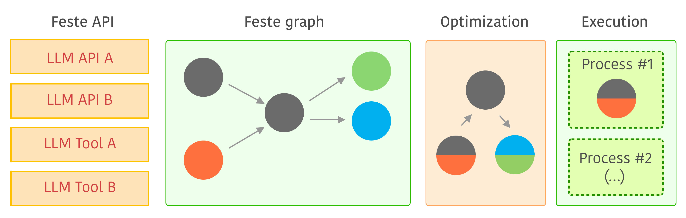

.. _architecture_design:

Architecture design
-------------------------------------------------------------------------------
Feste's architecture heavily relies in the concept of a graph. Instead of
executing actions immediately, Feste builds a graph of tasks with their
dependencies and what is needed to execute them. This concept is very similar
to the "delayed" concept of `Dask <https://docs.dask.org/en/stable/delayed.html>`_
and Feste uses Dask graph representation internally, but with different goals
of optimization and scheduling.

   
   Feste architecture diagram. The flow starts by user defining the graph
   using Feste API, then Feste optimizes the graph statically and executes
   it using a scheduler. Note that Feste will also optimize the execution
   depending on tasks becoming ready or not.

As you can see in the image above, the following components are shown:

* **Feste API**: this is the API that you use to build the graph. More
  documentation about it can be seen at :ref:`Feste API <api-docs>`
  docs. One example of this API is LLMs APIs like 
  :mod:`feste.backend.openai` or :mod:`feste.backend.cohere`.

* **Feste Graph**: the :mod:`feste.graph` is the main graph manipulation
  API, it is based on Dask's graph with minor changes, but we expect to
  diverge more and more from Dask graph implementation as we implement
  more features in Feste.

* **Optimization**: The :mod:`feste.optimization` API is mainly of internal
  use and it is responsible for things like automatic batching both as a
  static optimization (on the graph before execution) and also as a dynamic
  optimization during execution by a scheduler.

  .. note:: At the moment we only support automatic batching as static
            optimization, but soon the dynamic optimization will be 
            implemented as well.

* **Execution**: The execution is handled by the :mod:`feste.compute` and
  the :mod:`feste.scheduler` API. 

  .. note:: Right now we only support local multiprocessing but we are
            working to support Dask distributed as well.

Eager mode
-------------------------------------------------------------------------------
Feste also offers a **eager mode**, where tasks are executed immediately without
building a graph and scheduling execution. This is very useful especially 
for when you need to debug code.

To enable eager mode, just use Feste :mod:`feste.context` configuration as
shown in the example below:

.. code-block:: python
    :emphasize-lines: 3
    
    from feste import context
    from feste.prompt import Prompt

    with context.set(eager=True):
      p = Prompt("Hello {{message}}!")
      res = p(message="world")

    print(res)
    "Hello world!"

Note the emphasis on the use of the context configuration (:class:`feste.context.set`),
which allows you to temporarily enable eager mode (which is disabled by default).