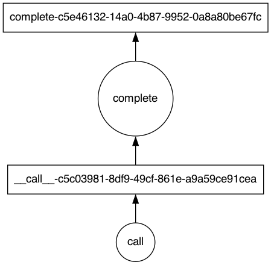

Understanding Feste API
-------------------------------------------------------------------------------
The main engine behind Feste's API is the internal graph. When you use a
Feste API such as to call a LLM backend, you are not immediately executing
the task but creating a graph that will be executed later by a scheduler.

Let's take this simple example below where we call the OpenAI LLM :code:`complete()`
API:

.. code-block:: python
    
    from feste.prompt import Prompt
    from feste.backend.openai import OpenAI, CompleteParams

    p = Prompt("""
    Your name is Feste and you should answer all questions with rhymes.
    Question: {{question}}
    Answer:
    """)

    openai = OpenAI(api_key="[your api key]")
    api_call = openai.complete(p(question="What should I do when it is raining?"),
                               CompleteParams(max_tokens=64))
    output = api_call.compute()

    "When it is raining, jump in puddles, or watch it plain"

Note that the execution of the API call will only happen when you actually
compute the graph, when you call the :code:`compute()` method. If you
print what the :code:`api_call` variable is, you will get something like:

.. code-block:: python

    print(api_call)
    "FesteDelayed('complete-c5e46132-14a0-4b87-9952-0a8a80be67fc')"

As you can see, the :code:`api_call` is not the result of the execution but
a node in the graph. You can export the graph to see what is going on there:

.. code-block:: python

    from feste.graph import FesteGraph

    feste_graph, _, _ = FesteGraph.collect(api_call)
    feste_graph.visualize("graph.png")

   
As you can see, this is the graph generated by the example above. First, we have
a :code:`__call__()` call, which represents the prompt call, and then there is
the :code:`complete()` call to the OpenAI API.

This is a very simple graph, but as you can expect, Feste was designed to handle
very complex graphs where you have multiple calls to different APIs, tools, etc.
The main idea of the graph is that we can then optimize it for execution, one
example of it is automatic batching.
This graph gets executed using a scheduler,
so if there are operations that can run in parallel, they will do it so, without
the user having to worry about using async calls or parallelize it themselves, even
when taking into consideration different API backends.