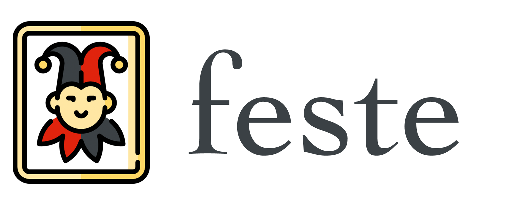

|Lint| |Tests| |Coverage| |License|

Welcome to **Feste**. Feste is a free and open-source framework with
permissive license that allows scalable composition of NLP tasks
using a graph execution model that is optimized and executed by specialized
schedulers.

.. note:: Feste is currently under development, and accepting contributions.
          The API might change in early development stages. We are also expanding
          the support APIs and adding new features, stay tuned !

Contents
=================================
.. toctree::
   :maxdepth: 2

   why
   installation
   changelog
   getting_started
   api
   license

.. |Lint| image:: https://github.com/perone/feste/actions/workflows/test.yml/badge.svg
   :target: https://github.com/perone/feste/actions/workflows/lint.yml
.. |Tests| image:: https://github.com/perone/feste/actions/workflows/test.yml/badge.svg
   :target: https://github.com/perone/feste/actions/workflows/test.yml
.. |Coverage| image:: https://codecov.io/gh/perone/feste/branch/main/graph/badge.svg?token=OP45ZTZ6QX
   :target: https://codecov.io/gh/perone/feste
.. |License| image:: https://img.shields.io/badge/License-Apache_2.0-blue.svg
   :target: https://opensource.org/licenses/Apache-2.0
